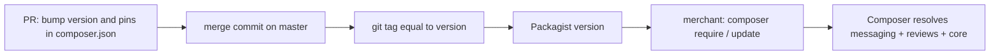
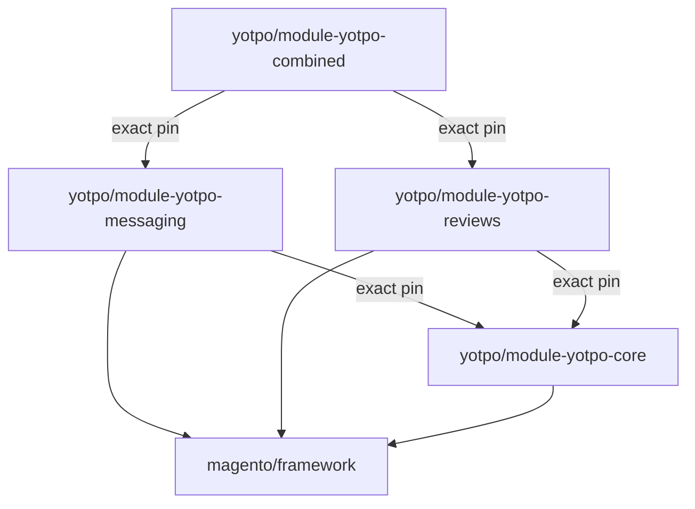

# Architecture

## System Overview
`yotpo/module-yotpo-combined` is a Composer metapackage (`composer.json:13`): a package with no files of its own
whose only job is to pull in a matched set of the Yotpo Magento 2 modules. A merchant runs
`composer require yotpo/module-yotpo-combined` in a Magento 2 root (`README.md:14-23`) and gets the messaging and
reviews modules, which in turn bring the shared core module. The value of this repository is the **pairing**: one
version of it names one messaging version and one reviews version that are known to install together.

## Module Map
| Module | Responsibility | Key Files | Owner |
|--------|---------------|-----------|-------|
| metapackage | Name, release `version`, the two exact pins | `composer.json` | Orbits |
| merchant docs | Install, configuration and compatibility guide (public) | `README.md` | Orbits |
| harness / pipeline config | Agent docs and ADLC contract | `CLAUDE.md`, `docs/`, `.agents/adlc/`, `.claude/`, `CODEOWNERS` | Orbits |

The PHP code lives in other repositories, each published to Packagist on its own:

| Package | Repository | Required by |
|---------|------------|-------------|
| `yotpo/module-yotpo-messaging` | `YotpoLtd/magento2-module-messaging` | this repo, exact pin (`composer.json:10`) |
| `yotpo/module-yotpo-reviews` | `YotpoLtd/magento2-module-reviews` | this repo, exact pin (`composer.json:11`) |
| `yotpo/module-yotpo-core` | `YotpoLtd/magento2-module-core` | messaging and reviews, each with its own exact pin |

## Data Flow
There is no runtime data flow. The only flow is a release, and the only consumer is Composer on a merchant's
Magento installation:

## Key Abstractions
- **Exact pins** -- `composer.json:10-11` name exact versions, never ranges, so a combined version always installs
  the same modules. A pin to an unpublished version or a conflicting pair breaks installs (see Constraints).
- **`version` field** -- `composer.json:4` carries the release version, and the release tag repeats it
  (tag `4.3.13`, `version` `4.3.13`). Composer checks the field against the tag [1].

## Extension Points
- To ship new messaging or reviews code to merchants: release it in its own repository first, then bump its pin
  and `version` here, then tag.
- To add another Yotpo module to the bundle: add one more exact pin to `require` (a human-required change).

## Boundaries
- This repository holds no PHP code. Code changes belong in the module repositories above; README usage snippets
  (`README.md:33-41`) describe code in `yotpo/module-yotpo-reviews`.

## Dependency Graph

**Forbidden imports** (dependency rules):
- The messaging and reviews versions pinned together must require the **same** `yotpo/module-yotpo-core`
  version. `4.3.11` pinned messaging `4.3.7` (core `4.3.8`) with reviews `4.3.9` (core `4.3.9`) and could not
  be installed; `4.3.12` fixed it (commit `93d4f48`, PR #102).

## Domain Ownership

| Domain | Owner | Models | Workers/Jobs | Key Invariants | Known Fragility |
|--------|-------|--------|--------------|----------------|-----------------|
| Magento combined package | Orbits (`CODEOWNERS`) | none | none | pins exist on Packagist; both pins share one core version; tag equals `version` | releases are manual and no CI checks them |

## Cross-Domain Flows

### Release
**Trigger:** a new messaging or reviews version, or a Magento compatibility release.

**Execution Order:**
1. Release the changed module in its own repository (Packagist).
2. PR here: bump the pin(s) and `version` in `composer.json`.
3. Merge (merge commit).
4. Push a git tag equal to `version` on the merge commit.

**Failure Modes:**
- Pin to a version not yet on Packagist: the combined version cannot be installed (commit `b0d40e9`, PR #98).
- Pins that require different core versions: Composer cannot resolve (PR #102).
- Tag and `version` differ: Composer skips the tag [1].

## Architectural Decisions
No ADRs are recorded yet. The index is [docs/adr/README.md](docs/adr/README.md).

## Constraints
- Compatibility: `README.md:8-10` promises Magento 2.3.3+ for module 4.0.0+ and Magento 2.4.8 for 4.3.3+.
- Releases are public and immutable in practice: merchants pin combined versions, so a broken tag stays
  installable until a new version supersedes it (4.3.11 → 4.3.12).

# Citations

[1] Composer schema, `version` (https://getcomposer.org/doc/04-schema.md#version)
[2] Packagist metadata for yotpo/module-yotpo-combined, -messaging, -reviews, -core (https://repo.packagist.org/p2/yotpo/module-yotpo-combined.json)
